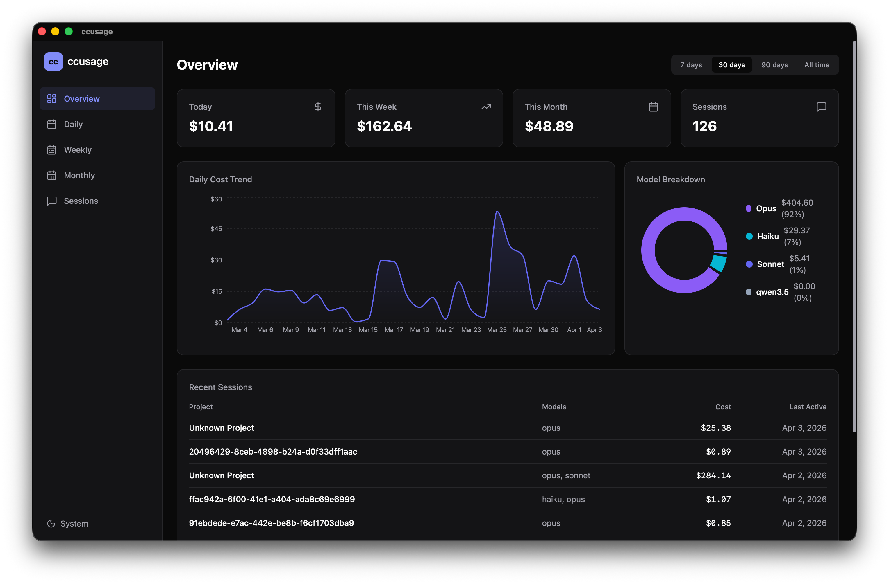
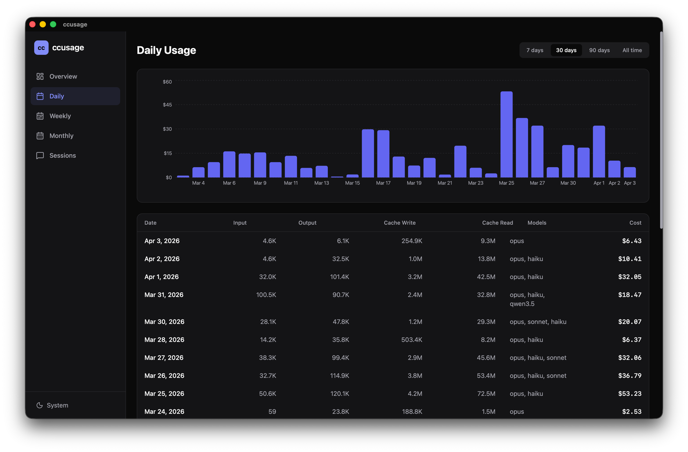
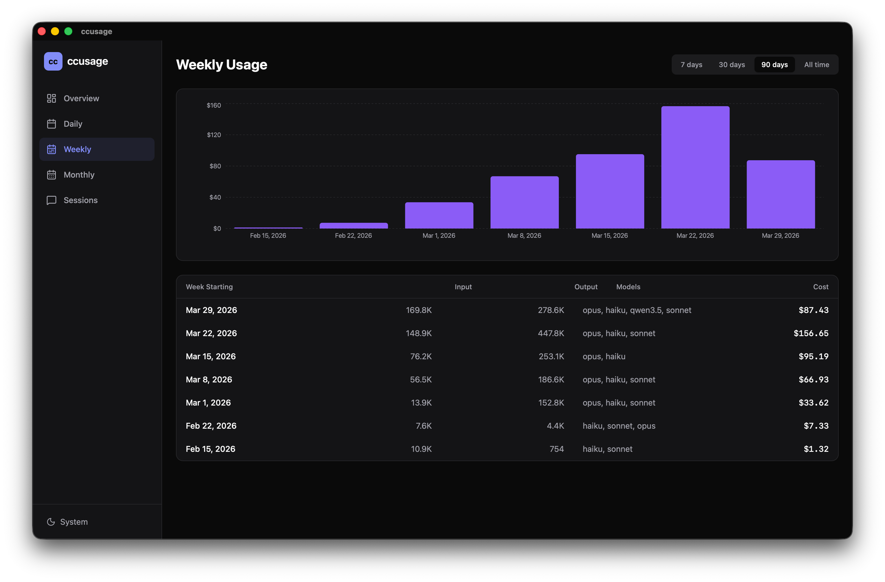
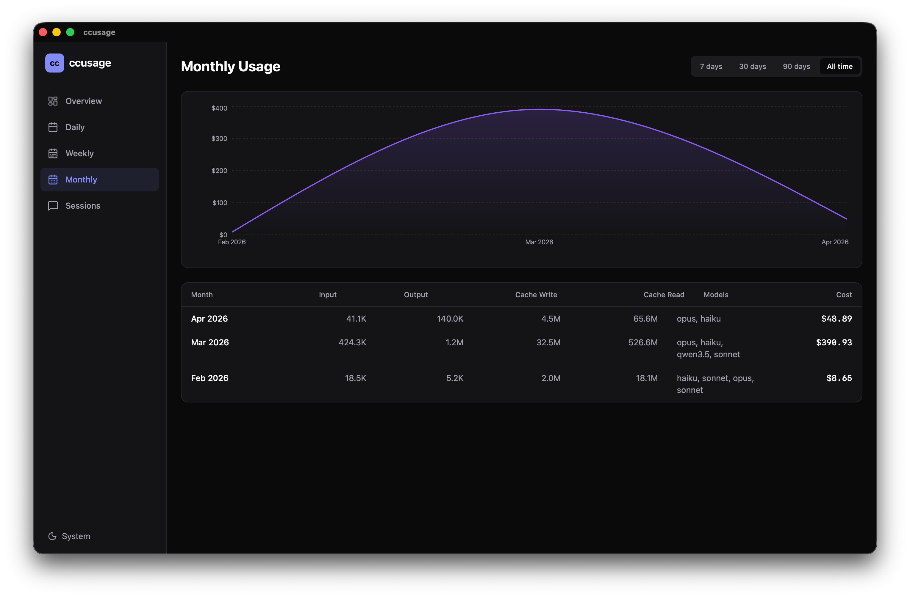
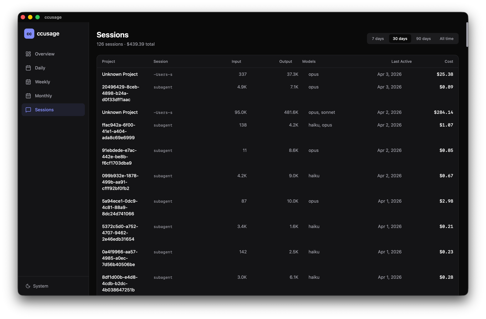

# ccusage-desktop

Desktop dashboard for [Claude Code](https://claude.ai/claude-code) usage analytics, built with Tauri 2 + React.

Visualize your Claude Code token usage with daily, weekly, monthly, and per-session breakdowns. Powered by the [ccusage](https://www.npmjs.com/package/ccusage) CLI library.

## Preview

| Overview | Daily Usage |
|----------|-------------|
|  |  |

| Weekly Usage | Monthly Usage |
|--------------|---------------|
|  |  |

| Sessions |
|----------|
|  |

## Architecture

```
React (Vite + TailwindCSS)  ←→  Tauri (Rust)  ←→  Bridge (Bun + ccusage)
         Frontend                   Shell              Data layer
```

- **Frontend** (`src/`) — React 19 with React Router, TanStack Query, Recharts, and Tailwind CSS v4
- **Tauri backend** (`src-tauri/`) — Rust commands with in-memory caching; spawns the bridge as a child process
- **Bridge** (`bridge/`) — Bun script that wraps `ccusage` data-loading functions over a JSON stdin/stdout protocol

## Prerequisites

- [Rust](https://rustup.rs/) (stable)
- [Bun](https://bun.sh/) (v1+)
- [Node.js](https://nodejs.org/) (v18+, for npm/npx if needed)
- Tauri system dependencies — see [Tauri prerequisites](https://v2.tauri.app/start/prerequisites/)

## Setup

```bash
# Install frontend dependencies
bun install

# Install bridge dependencies
cd bridge && bun install && cd ..
```

## Development

```bash
# Start the Tauri dev app (launches Vite + Rust backend together)
bun run tauri dev
```

This opens the desktop window at 1200x800 with hot-reload for the React frontend.

## Build

```bash
# Create a production bundle (.dmg / .app / .exe / .deb depending on platform)
bun run tauri build
```

The output goes to `src-tauri/target/release/bundle/`.

## Project Structure

```
├── bridge/          # Bun-based data bridge (wraps ccusage library)
├── public/          # Static assets
├── src/             # React frontend
│   ├── components/  # UI components (dashboard, layout, views)
│   ├── hooks/       # Custom React hooks
│   ├── lib/         # Utilities
│   └── styles/      # Global styles
├── src-tauri/       # Tauri / Rust backend
│   └── src/         # Rust source (bridge spawner, commands, cache)
└── docs/            # Screenshots
```

## License

MIT
